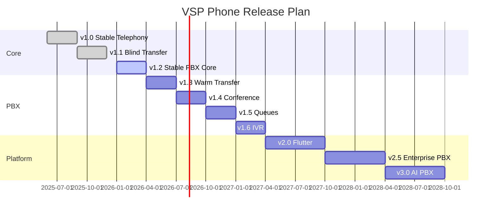

# Release Plan

Planned semver releases aligned with [../git/04-tagging.md](../git/04-tagging.md) and [03-feature-dependencies.md](./03-feature-dependencies.md).

---

## Release timeline

Dates are planning estimates — adjust after P0 exit criteria.

---

## Release catalog

### v1.0 — Stable telephony

| Item | Detail |
|------|--------|
| Tag | `v1.0.0` / `v1.0-telephony-stable` |
| Scope | Inbound/outbound WebRTC, bridge grace, basic routing |
| Status | ✅ Shipped (baseline) |

### v1.1 — Blind transfer

| Item | Detail |
|------|--------|
| Tag | `v1.1.0` |
| Scope | Cold transfer, transfer Redis sessions, web UI |
| Status | ✅ Shipped |

### v1.2 — Stable PBX core (current focus)

| Item | Detail |
|------|--------|
| Tag | `v1.2.0` |
| Scope | Multi-tenant DID, extension routing, audio stability P0, deployment KB |
| Status | 🔄 In progress |
| Exit | [05-merge-checklist](../git/05-merge-checklist.md) + P0 green |

### v1.3 — Warm transfer

| Item | Detail |
|------|--------|
| Tag | `v1.3.0` |
| Scope | Attended transfer, hold, consult leg, complete/cancel APIs |
| Depends | v1.2, blind transfer ✅ |
| Ref | [call-transfer plan](../../call-transfer-implementation-plan.html) Phase 2 |

### v1.4 — Conference

| Item | Detail |
|------|--------|
| Tag | `v1.4.0` |
| Scope | 3-way conference, consult bridge, Telnyx conference API |
| Depends | v1.3 warm transfer |

### v1.5 — Queues

| Item | Detail |
|------|--------|
| Tag | `v1.5.0` |
| Scope | ACD, enqueue/dequeue, basic wallboard metrics |
| Depends | v1.4, presence routing, ring groups ✅ |

### v1.6 — IVR

| Item | Detail |
|------|--------|
| Tag | `v1.6.0` |
| Scope | Multi-level IVR, holiday routing, advanced business hours |
| Depends | v1.5 optional; can parallel with queues if resources allow |

### v2.0 — Flutter mobile GA

| Item | Detail |
|------|--------|
| Tag | `v2.0.0` |
| Scope | Android GA, iOS beta, push, CallKit/ConnectionService, feature parity |
| Depends | v1.2 stable core |
| Ref | [08-mobile-roadmap.md](./08-mobile-roadmap.md) |

### v2.5 — Enterprise PBX

| Item | Detail |
|------|--------|
| Tag | `v2.5.0` |
| Scope | SSO, CRM connectors, supervisor tools, ECS HA |
| Depends | v1.5 queues, v2.0 mobile |
| Ref | [10-enterprise-roadmap.md](./10-enterprise-roadmap.md) |

### v3.0 — AI PBX

| Item | Detail |
|------|--------|
| Tag | `v3.0.0` |
| Scope | Transcription, call summary, sentiment, searchable archive |
| Depends | Recording ✅, v2.5 enterprise optional |
| Ref | [09-ai-roadmap.md](./09-ai-roadmap.md) |

---

## Release workflow per version

1. Features merge to `development` behind checklist [../git/05-merge-checklist.md](../git/05-merge-checklist.md)
2. Cut `release/vX.Y.Z`
3. QA: [05-testing-strategy.md](./05-testing-strategy.md) + [../deployment/14-telephony-validation.md](../deployment/14-telephony-validation.md)
4. Merge to `main`, tag, deploy EC2
5. [../git/06-release-checklist.md](../git/06-release-checklist.md)

---

## Related docs

- [02-priority-roadmap.md](./02-priority-roadmap.md)
- [03-feature-dependencies.md](./03-feature-dependencies.md)
- [../git/03-release-workflow.md](../git/03-release-workflow.md)
