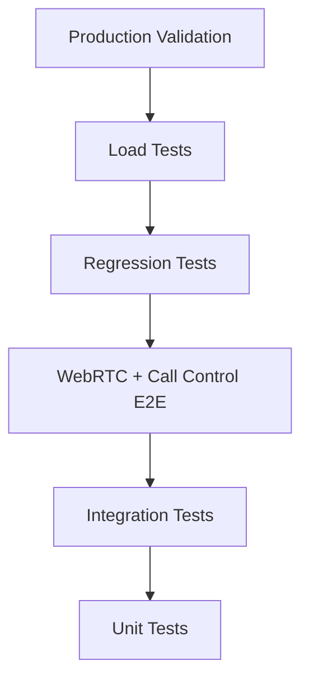

# Testing Strategy

Target testing layers for VSP Phone — current state vs planned.

---

## Testing pyramid



---

## Current state (June 2026)

| Layer | Status | Tools |
|-------|--------|-------|
| Unit tests | ❌ Minimal | Jest/Vitest not established |
| Integration tests | 🔄 Partial | `scripts/validate-*.js` against live API |
| WebRTC tests | 🔄 Partial | Manual + diagnostics page + `validate:inbound-media-phase1` |
| Call Control tests | 🔄 Partial | `validate:blind-transfer`, `validate:rapid-accept-stress` |
| Regression tests | 🔄 Partial | Pre-merge script, telephony checklist |
| Load tests | ❌ Not started | k6/Artillery planned |
| Production validation | ✅ Documented | [deployment/14-telephony-validation.md](../deployment/14-telephony-validation.md) |

---

## Unit tests (planned)

**Scope:** Pure functions, no Telnyx network.

| Module | Priority |
|--------|----------|
| `lib/numberRouting.js` | P1 |
| `lib/inboundRouting.js` target resolution | P1 |
| `resolveOutboundDestination` (softphone-dial) | P0 |
| `callControlSessionStore.js` key helpers | P1 |
| Prisma service layer mocks | P2 |

**Target:** 60% coverage on `lib/` routing and session helpers by v1.3.

---

## Integration tests (planned)

**Scope:** API + DB + Redis (test containers).

| Area | Cases |
|------|-------|
| Auth / JWT / tenant scope | Cross-tenant denial |
| DID assignment API | routingType changes |
| Extension CRUD | SIP username uniqueness per tenant |
| `/ready` | DB + Redis mock |
| Webhook signature | Valid / invalid Telnyx signature |

**Tooling:** Node test runner + Docker Compose test profile.

---

## WebRTC tests

| Type | Method |
|------|--------|
| Manual | [14-telephony-validation](../deployment/14-telephony-validation.md) |
| Diagnostics | Export JSON from `/softphone-v2/diagnostics` |
| Automated (planned) | Playwright + fake mic; assert RTP stats thresholds |
| Office network | [office-webrtc-capture-checklist](../../scripts/office-webrtc-capture-checklist.md) |

**P0 gate:** Two-way audio home + office before every release.

---

## Call Control tests

| Script | Covers |
|--------|--------|
| `validate:blind-transfer` | Transfer FSM |
| `validate:call-transfer-session` | Redis `cts:*` sessions |
| `validate:rapid-accept-stress` | Bridge grace races |
| `validate:exclusive-voicemail-audio` | VM path |
| `validate:recording-stream` | Recording playback |

**Planned:** Webhook fixture replay for `call.initiated` → `call.bridged` sequences.

---

## Regression tests

Run before every merge to `development`:

```bash
bash scripts/git-pre-merge-check.sh --telephony
```

Minimum:

```bash
npm run validate:p0
npm run validate:rapid-accept-stress   # if inbound touched
npm run validate:blind-transfer        # if transfer touched
```

Protected file changes: compare against stable tag per [../git/02-git-rules.md](../git/02-git-rules.md).

---

## Load tests (planned)

| Milestone | Target | Tool |
|-----------|--------|------|
| v1.2 | 50 concurrent webhook bursts | k6 |
| v1.5 | 200 concurrent sessions | k6 + Redis monitor |
| v2.5 | 1000 concurrent | ECS staging |

Scenarios: inbound spike, simultaneous ring, webhook retry storm.

---

## Production validation

Every deploy from `main`:

1. [../git/06-release-checklist.md](../git/06-release-checklist.md)
2. [../deployment/10-production-checklist.md](../deployment/10-production-checklist.md)
3. `node scripts/production-deployment-report.js`
4. Live inbound + outbound smoke call

---

## Related docs

- [04-release-plan.md](./04-release-plan.md)
- [06-performance-plan.md](./06-performance-plan.md)
- [../git/05-merge-checklist.md](../git/05-merge-checklist.md)
