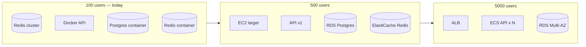

# Performance Plan

Scaling targets and infrastructure evolution for VSP Phone concurrent usage.

---

## Concurrent user targets

| Tier | Concurrent users | Tenants (est.) | Timeline |
|------|------------------|----------------|----------|
| **Pilot** | 100 | ~10 | Current (EC2 single instance) |
| **Growth** | 500 | ~50 | v1.5 – v2.0 |
| **Scale** | 1,000 | ~100 | v2.5 |
| **Enterprise** | 5,000 | ~500 | v3.0+ |

*Concurrent users* = active WebRTC registrations + active Call Control sessions, not total seats.

---

## Architecture by tier

Ref: [../../launch/production-deployment-guide.md](../../launch/production-deployment-guide.md)

---

## Component plans

### Database (PostgreSQL)

| Tier | Instance | Notes |
|------|----------|-------|
| 100 | Docker `postgres:16` on EC2 | Single volume backup |
| 500 | RDS `db.t4g.small` | SSL, daily snapshots |
| 1000 | RDS `db.t4g.medium` + read replica | Reporting queries |
| 5000 | RDS Multi-AZ + connection pooler (PgBouncer) | Prisma pool limits |

**Hot queries:** DID lookup, extension resolution, CDR insert, tenant cache.

### Redis

| Tier | Use | Notes |
|------|-----|-------|
| 100 | Docker Redis 7 | Session TTL 3600s |
| 500+ | ElastiCache | Required for horizontal API |
| 5000 | Redis cluster | Separate transfer vs session key prefixes |

**Critical:** Disable in-memory session fallback in production multi-instance.

### Docker / API

| Tier | Deployment |
|------|------------|
| 100 | Single `api` container, 2 vCPU / 4 GB EC2 |
| 500 | 4 vCPU / 8 GB; tune Node heap |
| 1000+ | ECS Fargate 2+ tasks behind ALB |
| 5000 | Auto-scaling on CPU + webhook queue depth |

Webhook handlers must stay **&lt; 2s p95** — offload heavy work to async jobs (future).

### Web (Next.js)

| Tier | Deployment |
|------|------------|
| 100 | PM2 single process |
| 500+ | PM2 cluster mode or ECS |
| 5000 | CDN for static assets; SSR scale-out |

WebRTC media does not scale through VSP — Telnyx handles RTP.

---

## Scaling checklist by release

| Release | Performance milestone |
|---------|----------------------|
| v1.2 | Baseline metrics at 100 users; `/ready` latency logged |
| v1.5 | Load test 200 webhook burst; Redis memory profile |
| v2.0 | Mobile concurrent registration test |
| v2.5 | ECS staging at 500 users |
| v3.0 | 1000+ user load test plan |

---

## Monitoring

| Signal | Tool | Alert |
|--------|------|-------|
| API `/ready` | UptimeRobot / cron | `ready: false` |
| Webhook latency | Docker logs + future APM | p95 &gt; 5s |
| Redis memory | `INFO memory` | &gt; 80% |
| Postgres connections | RDS metrics | pool exhaustion |
| Telnyx errors | Mission Control debugger | call failure spike |

See [../deployment/13-monitoring.md](../deployment/13-monitoring.md)

---

## Related docs

- [05-testing-strategy.md](./05-testing-strategy.md) — load tests
- [06-performance-plan.md](./06-performance-plan.md)
- [../architecture-decisions/redis.md](../architecture-decisions/redis.md)
