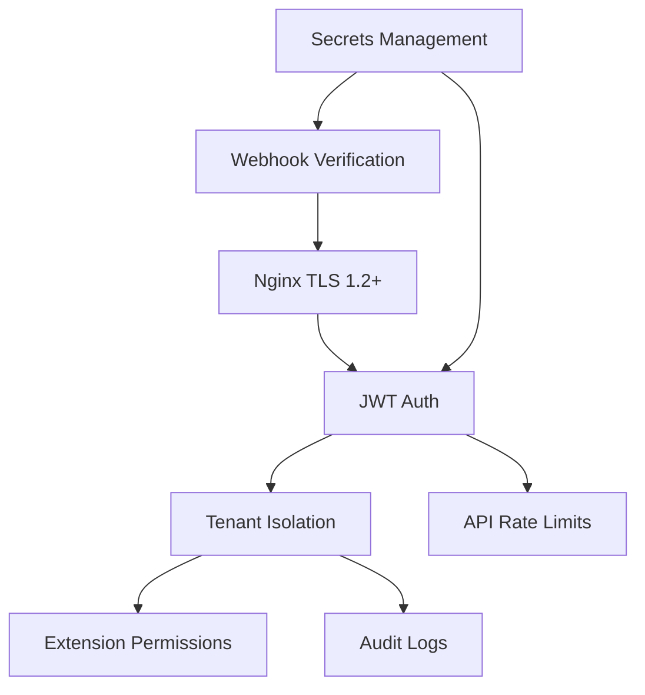

# Security Plan

Security roadmap for VSP Phone — current controls and planned hardening.

---

## Security layers

---

## Current controls

| Area | Status | Implementation |
|------|--------|----------------|
| **TLS** | ✅ | Nginx + Let's Encrypt on all public hosts |
| **JWT** | ✅ | Portal + API auth; `JWT_SECRET` in `.env` |
| **Tenant isolation** | ✅ | JWT `tenantId`; DID-scoped inbound |
| **Webhook signatures** | ✅ | Telnyx Ed25519; `WEBHOOK_STRICT` |
| **Telnyx API key** | ✅ | Server-side only |
| **WebRTC tokens** | ✅ | Short-lived telephony credential JWT |
| **Rate limits** | 🔄 Partial | Nginx `limit_req` on API; webhook exempt |
| **Helmet** | ✅ | Express security headers |
| **CORS** | ✅ | `WEB_ORIGIN`, `ADMIN_ORIGIN` allowlist |

---

## Permissions (gaps & plan)

| Item | Current | Target (v1.2) |
|------|---------|---------------|
| Extension outbound calling rules | Stored, not enforced at dial | Enforce in softphone + API |
| Role-based admin | SUPER_ADMIN vs tenant user | Fine-grained tenant roles (v2.5) |
| Recording consent | Greeting preamble option | Per-jurisdiction policy (v2.5) |

---

## Audit logs (planned)

| Event | Target release |
|-------|----------------|
| DID assignment changes | ✅ `DidAssignmentHistory` |
| Admin login / failed auth | v1.3 |
| Transfer / barge actions | v1.4 |
| Config changes (greeting, routing) | v1.3 |
| CRM data access | v2.5 |

Store: append-only table or external SIEM (v2.5 enterprise).

---

## API security roadmap

| Item | Priority | Release |
|------|----------|---------|
| Enforce outbound extension security | P0 | v1.2 |
| Per-tenant API rate limits (Redis) | P1 | v1.3 |
| IP allowlist for admin | P2 | v2.5 |
| OAuth2 / SSO for portal | P2 | v2.5 |
| API keys for integrations | P3 | v2.5 |

---

## Webhooks

| Control | Status |
|---------|--------|
| Signature verification | ✅ |
| HTTPS only in production | ✅ |
| Idempotent webhook handling | 🔄 Partial — session dedup keys |
| Replay protection | 📋 Planned — event ID cache |

---

## Secrets

| Secret | Rotation policy |
|--------|-----------------|
| `JWT_SECRET` | Planned rotation procedure v1.3; forces re-login |
| `TELNYX_API_KEY` | Manual via Telnyx portal |
| `SETTINGS_ENCRYPTION_KEY` | Never rotate without migration plan |
| DB credentials | RDS rotation v2.5 |

Never commit secrets. Use AWS Secrets Manager at ECS migration.

---

## Compliance targets (enterprise)

| Standard | Target |
|----------|--------|
| SOC 2 readiness | v2.5 |
| Call recording consent | v2.5 |
| Data retention policies | v3.0 |
| GDPR export/delete | v2.5 |

---

## Related docs

- [../pbx/22-security.md](../pbx/22-security.md)
- [07-security-plan.md](./07-security-plan.md)
- [10-enterprise-roadmap.md](./10-enterprise-roadmap.md)
