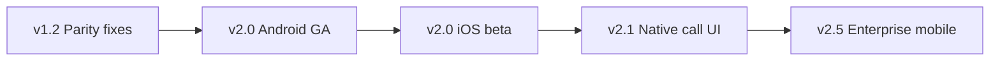

# Mobile Roadmap

Flutter mobile platform plan — Android today, iOS and native telephony integration tomorrow.

---

## Current state

| Item | Status |
|------|--------|
| Flutter Android app | ✅ Inbound/outbound WebRTC |
| API integration | ✅ Same JWT + softphone token endpoints |
| FCM push (Android) | 🔄 Partial |
| iOS app | ❌ Not shipped |
| Blind transfer on mobile | ❌ |
| Ring group admin | ❌ Web only |
| WebRTC diagnostics | ❌ Web only |

Code: `mobile/` — see [../pbx/19-mobile-app.md](../pbx/19-mobile-app.md)

---

## Mobile roadmap phases



---

## Phase 1 — v1.2 (parity & stability)

| Item | Detail |
|------|--------|
| Two-way audio | Align with web P0 fixes |
| Push reliability | FCM delivery metrics |
| Background registration | Keep-alive strategy |
| `call-accepted` bridge grace | Match web inbound flow |

---

## Phase 2 — v2.0 Flutter GA

| Item | Detail |
|------|--------|
| **Flutter** | Android production GA on Play / APK |
| **Push notifications** | Reliable incoming call alert |
| **iOS beta** | TestFlight with Telnyx Flutter SDK |
| Feature parity | VM, recordings, CDR, SMS read |
| Blind transfer | Port web transfer APIs |

Release tag: **v2.0.0** — [04-release-plan.md](./04-release-plan.md)

---

## Phase 3 — v2.1 Native telephony UI

| Item | Platform | Detail |
|------|----------|--------|
| **CallKit** | iOS | Native incoming call screen, lock screen |
| **ConnectionService** | Android | System call UI, Bluetooth routing |
| **Background calls** | Both | Answer/hangup when app backgrounded |
| **Offline handling** | Both | Queue CDR sync; show stale state clearly |

**Depends on:** Push notifications reliable (Phase 2).

---

## Phase 4 — v2.5 Enterprise mobile

| Item | Detail |
|------|--------|
| SSO mobile login | Enterprise IdP |
| MDM deployment | Managed app config |
| Supervisor mobile | Queue stats (read-only) |
| CRM screen-pop | Deep link from push payload |

---

## Testing (mobile)

| Test | Method |
|------|--------|
| Auth | `scripts/verify-mobile-auth.js` |
| Inbound | Physical device + Telnyx debugger |
| Push | FCM test payload |
| Background | OS-specific QA matrix |

Build:

```powershell
npm run build:mobile:android:release
```

---

## Dependencies

| Mobile feature | Requires |
|----------------|----------|
| CallKit | iOS app, push |
| ConnectionService | Android GA |
| Transfer | Web transfer API stable (v1.1 ✅) |
| Enterprise SSO | v2.5 auth backend |

See [03-feature-dependencies.md](./03-feature-dependencies.md)

---

## Related docs

- [04-release-plan.md](./04-release-plan.md)
- [../pbx/19-mobile-app.md](../pbx/19-mobile-app.md)
- [docs/telnyx/javascript-sdk/flutter/](../../telnyx/javascript-sdk/flutter/)
