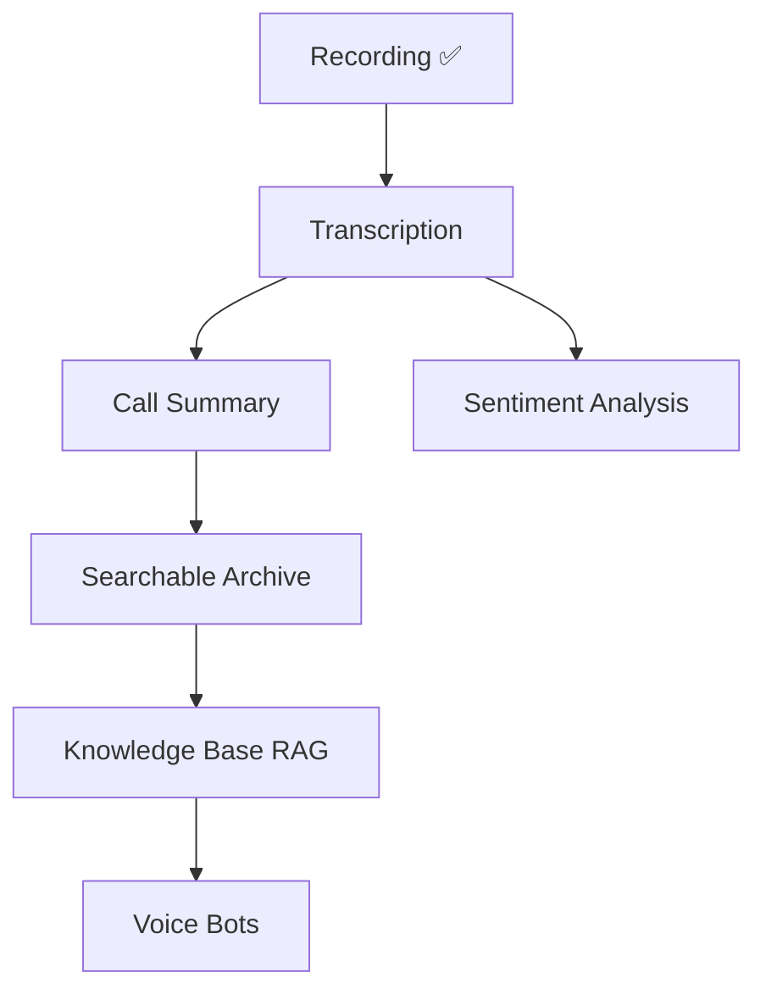

# AI Roadmap

AI-powered voice features for VSP Phone — transcription through voice bots.

**Target major release:** v3.0 AI PBX

---

## AI capability ladder

---

## Phase 1 — Transcription (v2.5 – v3.0)

| Item | Detail |
|------|--------|
| Input | `CallRecording` + voicemail audio URLs |
| Provider options | Telnyx STT, Whisper API, Deepgram |
| Storage | `Transcript` model — tenant-scoped |
| Trigger | Webhook post-recording or batch job |
| UI | Transcript tab on call detail |

**Depends on:** Recording pipeline ✅, tenant isolation ✅

---

## Phase 2 — Call summary (v3.0)

| Item | Detail |
|------|--------|
| Input | Transcript text |
| LLM | Structured summary (parties, action items, topics) |
| Storage | `CallSummary` linked to `CallLog` |
| UI | Summary card in portal + mobile |
| Privacy | Tenant opt-in; PII redaction option |

---

## Phase 3 — Sentiment & analytics (v3.0+)

| Item | Detail |
|------|--------|
| Sentiment | Per-call and aggregate trend |
| Topics | Keyword / intent tagging |
| Alerts | Negative sentiment supervisor notify |
| Depends | Queues + supervisor (v1.5 / v2.5) for contact center value |

---

## Phase 4 — Search & knowledge base (v3.0+)

| Item | Detail |
|------|--------|
| Search | Full-text across transcripts + summaries |
| Knowledge base | Index tenant docs for RAG |
| Agent assist | Real-time suggestions (future) |
| Vector store | pgvector or external (Pinecone) |

Internal KB precedent: `docs/telnyx/` sync pattern.

---

## Phase 5 — Voice bots (future)

| Item | Detail |
|------|--------|
| IVR + AI gather | Telnyx `gather_using_ai` |
| After-hours bot | Replace static IVR |
| Depends | Multi-level IVR (v1.6), transcription feedback loop |

Ref: [docs/telnyx/call-control/](../../telnyx/call-control/) AI gather docs.

---

## AI security & compliance

| Control | Requirement |
|---------|-------------|
| Tenant data isolation | Transcripts tenant-scoped |
| Retention | Configurable delete with CDR |
| Consent | Recording notice + AI processing opt-in |
| Model data | No training on customer audio without contract |

Cross-ref: [07-security-plan.md](./07-security-plan.md)

---

## Related docs

- [04-release-plan.md](./04-release-plan.md)
- [03-feature-dependencies.md](./03-feature-dependencies.md)
- [10-enterprise-roadmap.md](./10-enterprise-roadmap.md)
