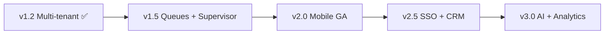
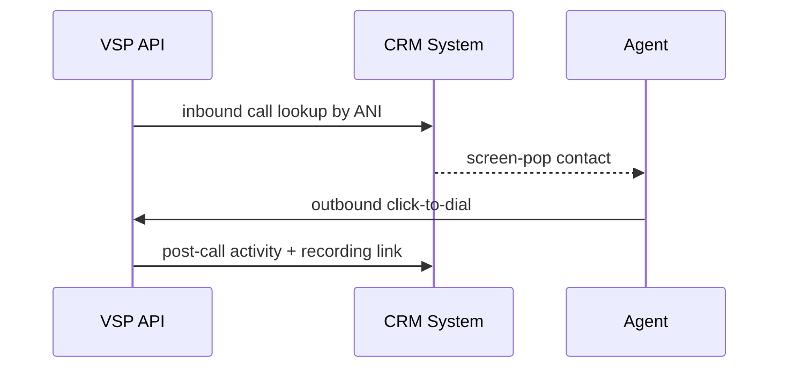

# Enterprise Roadmap

Enterprise PBX features — SSO, directories, CRM, and team integrations.

**Target major release:** v2.5 Enterprise PBX

---

## Enterprise maturity model

---

## Identity & access (v2.5)

| Feature | Detail | Depends |
|---------|--------|---------|
| **SSO** | SAML 2.0 / OIDC (Okta, Azure AD) | Auth refactor |
| **LDAP** | Read-only directory sync for extensions | SSO design |
| SCIM provisioning | Auto user create/deactivate | SSO |
| Fine-grained roles | Tenant admin, supervisor, agent | Audit logs |

---

## CRM integrations (v2.5)

| CRM | Integration type | Priority |
|-----|------------------|----------|
| **Salesforce** | Screen-pop, click-to-dial, activity log | P1 |
| **HubSpot** | Contact lookup, call logging | P1 |
| **Zoho CRM** | Call log sync | P2 |
| Generic webhook | Custom CRM adapter | P2 |

**Depends on:** Stable CDR ✅, optional queues for queue context pop.

---

## Team collaboration (v2.5+)

| Platform | Use case |
|----------|----------|
| **Microsoft Teams** | Presence sync; click-to-call (future) |
| **Slack** | Missed call notifications; VM alerts |
| Webhook notifications | Generic enterprise automation |

---

## Supervisor & wallboard (v1.5 – v2.5)

| Feature | Release |
|---------|---------|
| Live queue stats | v1.5 |
| Agent state board | v1.5 |
| Listen / whisper / barge | v2.5 |
| Real-time WebSocket dashboard | v2.5 |

Requires call queues — [03-feature-dependencies.md](./03-feature-dependencies.md)

---

## Infrastructure (enterprise)

| Item | Target |
|------|--------|
| ECS / multi-AZ | v2.5 |
| RDS Multi-AZ Postgres | v2.5 |
| ElastiCache Redis | v2.5 |
| WAF on ALB | v2.5 |
| SOC 2 preparation | v2.5 – v3.0 |

Ref: [../../launch/production-deployment-guide.md](../../launch/production-deployment-guide.md)

---

## Enterprise sales checklist

Before selling enterprise tier:

- [ ] SSO operational
- [ ] At least one CRM connector
- [ ] Queues + supervisor
- [ ] 99.9% uptime SLA infrastructure
- [ ] Audit log export
- [ ] Dedicated support runbook

---

## Related docs

- [04-release-plan.md](./04-release-plan.md)
- [07-security-plan.md](./07-security-plan.md)
- [09-ai-roadmap.md](./09-ai-roadmap.md)
- [../features.md](../features.md)
